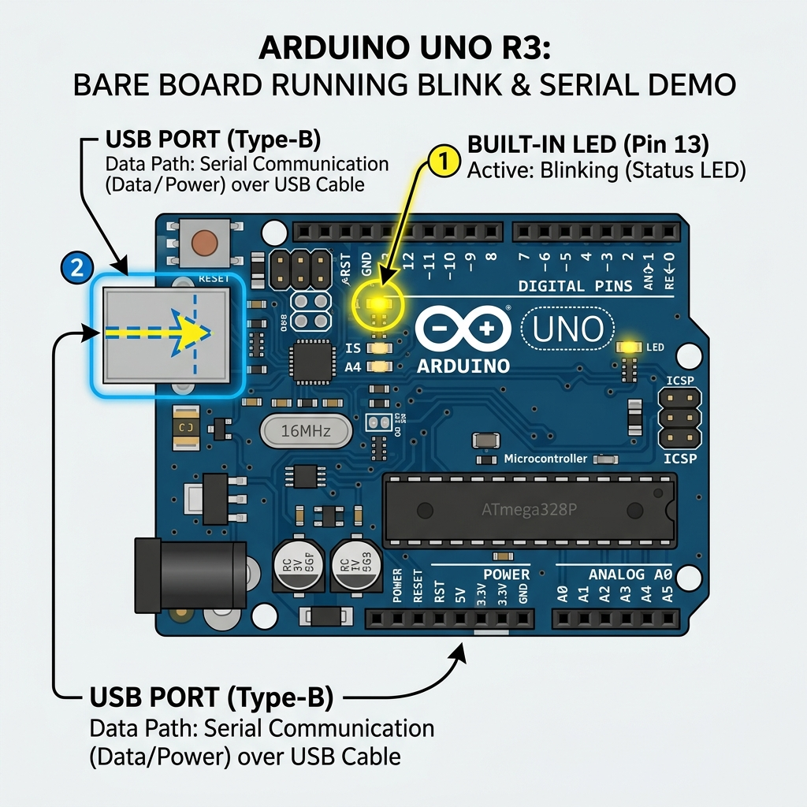

## FREE Reverse Engineering Self-Study Course [HERE](https://github.com/mytechnotalent/Reverse-Engineering-Tutorial)

<br>

# arduino-hal

A bare-metal Rust, register-level Hardware Abstraction Layer (HAL) for the ATmega328P microcontroller, primarily used on the Arduino Uno R3.

<br>

## Getting Started

Because the ATmega328P is an AVR microcontroller, you will need the Rust `nightly` toolchain and the AVR GCC toolchain installed on your system. Follow the steps below for your operating system.

---

### 1. Install Rust Toolchain

If you haven't installed Rust yet, install it via [rustup](https://rustup.rs/):

**macOS / Linux:**
```bash
curl --proto '=https' --tlsv1.2 -sSf https://sh.rustup.rs | sh
```
*(On Windows, download and run `rustup-init.exe` from the official site).*

Next, switch to the `nightly` toolchain and install the `rust-src` component. This is strictly required for cross-compiling the `core` library for AVR:
```bash
rustup default nightly
rustup component add rust-src
```

---

### 2. Install AVR Dependencies

You'll need `avr-gcc` and `avr-libc` for linking, and `avrdude` for flashing the compiled machine code onto your Arduino Uno hardware.

#### macOS (Intel & Apple Silicon)
**Important:** Do NOT use `brew tap osx-cross/avr` as it often forces a from-source build that takes hours.
Instead, install the [Arduino IDE](https://www.arduino.cc/en/software) which bundles pre-compiled AVR binaries, and export them to your PATH:

```bash
# Add the Arduino bundled AVR GCC to your PATH (adjust version if necessary)
export PATH="$HOME/Library/Arduino15/packages/arduino/tools/avr-gcc/7.3.0-atmel3.6.1-arduino7/bin:$PATH"

# Verify installation
avr-gcc --version

# Install just avrdude via Homebrew for flashing
brew install avrdude
```

#### Linux (Debian / Ubuntu)
```bash
sudo apt-get update
sudo apt-get install gcc-avr avr-libc avrdude pkg-config
```

#### Linux (Arch / Manjaro)
```bash
sudo pacman -S avr-gcc avr-libc avrdude
```

#### Windows
You have a couple of options on Windows. **Option A (Scoop)** is generally the fastest for a clean CLI setup.

**Option A: Using Scoop**
Open PowerShell and run:
```powershell
scoop install avr-gcc avrdude
```

**Option B: Using MSYS2**
If you have MSYS2 installed, open the MSYS2 MinGW terminal and run:
```bash
pacman -S mingw-w64-x86_64-avr-gcc mingw-w64-x86_64-avrdude
```
*(Alternatively, you can download the [Microchip AVR Toolchain](https://www.microchip.com/en-us/tools-resources/develop/microchip-studio/gcc-compilers) standalone installer for Windows).*

---

### 3. Building the Project

Once the AVR GCC dependencies are installed, you can build the project. The `Cargo.toml` contains the standard `avr-mcu = "atmega328p"` configurations.

To build the HAL library on your host machine (this is what `rust-analyzer` uses):
```bash
cargo build --lib
```

To build the entire project (including the embedded demo binary) for the Arduino:
```bash
cargo build --release
```
*(Thanks to our `.cargo/config.toml`, this will automatically cross-compile for the AVR architecture!)*

---

### 4. Running Tests

This project includes an extensive suite of mock-based unit tests for the HAL, ensuring 100% test coverage (including the provided demo module). 

You can run the tests directly on your host machine (they do not require the Arduino to be plugged in, thanks to the mock AVR IO register design). 

Because we use a custom `.cargo/config.toml` that forces `build-std = ["core"]` for the Arduino, we must temporarily disable that override when testing natively on your host machine to avoid `duplicate lang item` collisions with your computer's built-in standard library.

**Mac (Apple Silicon):**
```bash
cargo test --lib --target aarch64-apple-darwin --config "unstable.build-std=[]"
```

**Linux (Intel/AMD 64-bit):**
```bash
cargo test --lib --target x86_64-unknown-linux-gnu --config "unstable.build-std=[]"
```

**Windows (64-bit):**
```bash
cargo test --lib --target x86_64-pc-windows-msvc --config "unstable.build-std=[]"
```

---

### 5. Running the Demo

To test the HAL on actual hardware, you can compile and flash the `demo` binary included in this crate. 

#### Hardware Setup

The demo binary (`src/bin/demo.rs`) is beautifully simple and requires **zero external wires or components**. It only utilizes:
1. The built-in LED (hardwired to Digital Pin 13 / `PB5`).
2. The built-in Serial-over-USB connection (`USART0` on `PD0`/`PD1`).

Simply plug your Arduino Uno R3 into your computer via USB and you're ready to go! The LED will blink, and you can open your Serial Monitor (at 9600 baud) to see the `"Hi\r\n"` messages.



Run the following commands directly from inside the `arduino-hal` folder:

To build the entire project and automatically flash the embedded demo binary to your Arduino Uno, you must use `--release` so the binary is optimized to fit inside the Arduino's tiny 2KB SRAM:
```bash
cargo run --release --bin demo
```
*(Thanks to our `.cargo/config.toml`, this will automatically cross-compile for the AVR architecture and invoke `ravedude` to flash it!)*

<br>

See [LICENSE](https://github.com/mytechnotalent/arduino-hal/blob/main/LICENSE).
